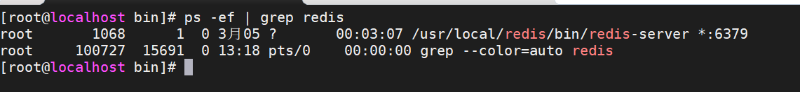

# Redis单机环境搭建

## 一、依赖安装

由于 redis 是用 C 语言开发，安装之前必先确认是否安装 gcc 环境（gcc -v），如果没有安装，执行以下命令进行安装

```sh
yum install -y gcc 
```

## 二、下载并解压安装包

```sh
wget http://download.redis.io/releases/redis-6.0.6.tar.gz
tar -zxvf redis-6.0.6.tar.gz
```

## 三、编译源文件

```sh
cd redis-6.0.6
make
```

## 四、安装并指定安装目录

```sh
make install PREFIX=/usr/local/redis
```

## 五、启动服务

1. 前台启动

```sh
cd /usr/local/redis/bin/
./redis-server
```   

2. 后台启动

从 redis 的源码目录中复制 redis.conf 到 redis 的安装目录

```sh
cp /root/software/redis-6.0.6/redis.conf /usr/local/redis/bin/
```

修改 redis.conf 文件，把 daemonize no 改为 daemonize yes

```sh
vi redis.conf
```


启动命令

```sh
./redis-server redis.conf
```



3. 修改数据,日志,配置文件位置(可选)

* 创建目录

```shell
cd /usr/local/redis
mkdir data log conf
cp /root/software/redis/redis-6.2.6/redis.conf /usr/local/redis/conf
```
   
* 修改配置

```shell
########## NETWORK ##########
bind 192.168.7.100
port 6139
########## GENERAL ###########
daemonize yes
pidfile /var/run/redis_6139.pid
logfile /usr/local/redis/log/redis.log
######### SNAPSHOTTING  ##########
requirepass 123456
######### SNAPSHOTTING  ##########
dir /usr/local/redis/data
####### APPEND ONLY MODE #####
appendonly yes
```

## 六、设置开机启动

1. 添加开机启动服务

```sh
vi /usr/lib/systemd/system/redis.service
```

2. 复制粘贴以下内容：

```sh
[Unit]
Description=redis-server
After=network.target

[Service]
Type=forking
ExecStart=/usr/local/redis/bin/redis-server /usr/local/redis/conf/redis.conf
PrivateTmp=true

[Install]
WantedBy=multi-user.target
```

注意：ExecStart配置成自己的路径 

3. 设置开机启动

```
systemctl daemon-reload
systemctl start redis.service
systemctl enable redis.service
```

## 七、客户端连接

1. 创建 redis客户端命令软链接	

```sh
ln -s /usr/local/redis/bin/redis-cli /usr/bin/redis-cli
```

2. 执行客户端连接

```
redis-cli

或者知道ip和端口单机连接
redis-cli -h 192.168.7.100 -p 7000

集群连接方式
redis-cli -c -h 192.168.242.130 -p 7000
```

如果有密码,客户端内执行下面命令

```sh
auth password
```


## 八、其他操作

```sh
systemctl start redis.service   #启动redis服务

systemctl stop redis.service   #停止redis服务

systemctl restart redis.service   #重新启动服务

systemctl status redis.service   #查看服务当前状态

systemctl enable redis.service   #设置开机自启动

systemctl disable redis.service   #停止开机自启动
```

## 九、ACL

> 在Redis6之前的版本，我们只能使用requirepass参数给default用户配置登录密码，同一个Redis集群的所有开发都共享default用户，难免会出现误操作把别人的key删掉或者数据泄露的情况。
  
> 因此Redis6版本退出了ACL（Access Controller List）访问控制权限的功能，基于次功能，我们可以设置多个用户，并且给每一个用户单独设置命令权限和数据权限。为了保证向下兼容性，Redis6保留了default用户和使用requirepass 的方式给default用户设置密码，默认情况下default用户拥有Redis最大权限，我们使用的redis-cli链接时如果没有指定用户，默认也是default
  
1.配置ACL

> 配置 ACL 的方式有两种，一种是在 config 文件中直接配置，另一种是在外部 aclfile 中配置。配置的命令是一 样的，但是两种方式只能选择其中一种，
>我们之前使用 requirepass 给 default 用户设置密码 默认就是使用 config 的方式，执行 config rewrite 重写配置后会自动在 config 文件最下面新增一行记录配置 default 的密码和权限  

```text
#1.查看当前所有用户
127.0.0.1:6379> acl list
user default on #a665a45920422f9d417e4867efdc4fb8a04a1f3fff1fa07e998e86f7f7a27ae3 ~* +@all

#2.配置ACL
* 方式一
127.0.0.1:6379> config rewrite
OK   #执行config rewrite重写配置后会自动在conf文件最下面新增一行记录配置default的密码和权限
[root@redis01 ~]# cd /usr/local/redis/conf
[root@redis01 ~]# egrep 'user default on' /usr/local/redis/conf/redis.conf 
user default on a665a45920422f9d417e4867efdc4fb8a04a1f3fff1fa07e998e86f7f7a27ae3 ~* +@all
```

2.Redis设置密码

> 在Redis6之前，Redis只有一个default用户也是Redis中的超级管理员用户，如果要将其设置密码，需要修改Redis的配置文件

```text
#设置密码
[root@redis01 ~]# vim /usr/local/redis/conf/redis.conf 
requirepass 123  #可将此内容注释即没有密码，或修改其他密码

#验证
[root@redis01 ~]# systemctl restart redis
[root@redis01 ~]# redis-cli 
127.0.0.1:6379> set a b
OK
```

3.使用ACL

> 我们可以直接在conf配置文件中使用上面default用户ACL这行DSL命令设置用户权限，或者我们也可以配置外部aclfile配置权限。配置aclfile需要先将conf中配置的DSL注释或者删除。
> 因为Redis不允许两种ACL管理方式同时使用，否则在启动Redis的时候会报错

使用外部 aclfile 文件配置 Default 和其他用户的 ACL 权限

```text
1.注释 redis.conf 中所有已授权的 ACL 命令，如：
#user default on8d969eef6ecad3c29a3a629280e686cf0c3f5d5a86aff3ca12020c923adc6c92
~* +@all

2.在 config 文件中注释 default 用户的密码，因为开启 aclfile 之后，requirepass 的密码就失效了：
redis.conf
#requirepass 123456

3.在 config 文件中配置 aclfile 的路径，然后创建该文件，否则重启 redis 服务会报错找不到该文件
aclfile /usr/local/redis/etc/users.acl
touch /usr/local/redis/etc/users.acl

5.重启 redis 服务或使用 aclfile load 命令加载权限
systemctl restart redis
或
在 redis 命令行中执行：
aclfile loa
#1.创建用户
127.0.0.1:6379> acl setuser test  #创建用户（不设置密码权限默认没有密码没有任何权限）
OK
127.0.0.1:6379> acl list  #查看用户
user default on a665a45920422f9d417e4867efdc4fb8a04a1f3fff1fa07e998e86f7f7a27ae3 ~* +@all
user test on -@all

#2.启用用户
（用户默认情况下，是未激活状态）
127.0.0.1:6379> acl setuser test on  #激活用户
OK
127.0.0.1:6379> acl list
user default on a665a45920422f9d417e4867efdc4fb8a04a1f3fff1fa07e998e86f7f7a27ae3 ~* +@all
user test on -@all

#3.给用户增加密码
127.0.0.1:6379> acl setuser test on >123
OK
127.0.0.1:6379> acl list
user default on a665a45920422f9d417e4867efdc4fb8a04a1f3fff1fa07e998e86f7f7a27ae3 ~* +@all 
#+@all代表拥有所有权限
user test on #a665a45920422f9d417e4867efdc4fb8a04a1f3fff1fa07e998e86f7f7a27ae3 -@all 
#-@all代表所有权限都没有

#4.查看当前用户
127.0.0.1:6379> acl whoami
"default"  #可以看做Redis的超级用户，拥有所有权限

#5.登录普通用户，是没有acl权限的
[root@redis01 ~]# redis-cli 
127.0.0.1:6379> auth test 123
OK
127.0.0.1:6379> acl list
(error) NOPERM this user has no permissions to run the 'acl' command or its subcommand

#6.认证
127.0.0.1:6379> auth default 123
OK
127.0.0.1:6379> acl whoami
"default"

#7.给用户设置权限
127.0.0.1:6379> acl setuser test on >123 ~name* +@all  #给test用户以name开头的key加上所有权限
127.0.0.1:6379> acl setuser test on >123 ~name* +set   #给test用户以name开头的key加上set权限
OK
127.0.0.1:6379> acl list
1) "user default on nopass ~* +@all"
2) "user test on #a665a45920422f9d417e4867efdc4fb8a04a1f3fff1fa07e998e86f7f7a27ae3 ~name* +@all"

127.0.0.1:6379> acl setuser dashuju  #创建大数据用户
OK
127.0.0.1:6379> acl setuser dashuju on >123 ~dashuju* +set +get  #给大数据用户的dashuju开头的key授set get权限
OK
127.0.0.1:6379> acl list
1) "user dashuju on #a665a45920422f9d417e4867efdc4fb8a04a1f3fff1fa07e998e86f7f7a27ae3 ~dashuju* -@all +set +get"
2) "user default on nopass ~* +@all"
3) "user test on #a665a45920422f9d417e4867efdc4fb8a04a1f3fff1fa07e998e86f7f7a27ae3 ~name* +@all"

#8.展示所有的用户
127.0.0.1:6379> acl list
user dashuji on #a665a45920422f9d417e4867efdc4fb8a04a1f3fff1fa07e998e86f7f7a27ae3 ~dashuju* -@all +get +set
user dashuju off -@all
user default on #a665a45920422f9d417e4867efdc4fb8a04a1f3fff1fa07e998e86f7f7a27ae3 ~* +@all
user test on #a665a45920422f9d417e4867efdc4fb8a04a1f3fff1fa07e998e86f7f7a27ae3 -@all

#9.展示所有用户名
127.0.0.1:6379> acl users
dashuji
dashuju
default
test

#10.展示当前用户
127.0.0.1:6379> acl whoami
"default"

#11.展示当前可授权限
127.0.0.1:6379> acl cat
 1) "keyspace"
 2) "read"
 3) "write"
 4) "set"
 
#12.查看一个用户所有的key
127.0.0.1:6379> acl getuser test
flags
on
passwords
a665a45920422f9d417e4867efdc4fb8a04a1f3fff1fa07e998e86f7f7a27ae3
commands
-@all
keys

#13.删除一个用户
127.0.0.1:6379> acl list
user dashuju off -@all
user default on #a665a45920422f9d417e4867efdc4fb8a04a1f3fff1fa07e998e86f7f7a27ae3 ~* +@all
127.0.0.1:6379> acl deluser dashuji   #删除大数据用户
user dashuju off -@all
user default on #a665a45920422f9d417e4867efdc4fb8a04a1f3fff1fa07e998e86f7f7a27ae3 ~* +@all
user test on #a665a45920422f9d417e4867efdc4fb8a04a1f3fff1fa07e998e86f7f7a27ae3 -@all
4.保存ACL
我们可以使用 acl save 命令将当前服务器中的 ACL 权限持久化到 aclfile 中，如果没持久化就关闭 redis 服务， 那些 ACL 权限就会丢失，因此我们每次授权之后一定要记得 ACL SAVE 将 ACL 权限持久化到 aclfile中。

#1.首先在redis.conf配置文件中启用aclfile文件
[root@redis01 conf]# vim /usr/local/redis/conf/redis.conf
aclfile /usr/local/redis/conf/users.acl

#2.重启redis，如果没有user.acl文件可以手动创建一个
[root@redis01 ~]# systemctl restart redis
[root@redis01 conf]# ll
总用量 84
-rw-r--r-- 1 root root 85015 5月   1 20:29 redis.conf
[root@redis01 conf]# touch users.acl
[root@redis01 conf]# ll
总用量 84
-rw-r--r-- 1 root root 85015 5月   1 20:29 redis.conf
-rw-r--r-- 1 root root     0 5月   1 20:31 users.acl

#3.redis-cli连接到server
[root@redis01 ~]# redis-cli 
127.0.0.1:6379> acl list
1) "user default on nopass ~* +@all"
127.0.0.1:6379> acl setuser test on >123 ~name* +@all
OK
127.0.0.1:6379> acl list
1) "user default on nopass ~* +@all"
2) "user test on #a665a45920422f9d417e4867efdc4fb8a04a1f3fff1fa07e998e86f7f7a27ae3 ~name* +@all"
127.0.0.1:6379> acl save
OK
#4.查看文件是否存入内容
[root@redis01 conf]# ll  #没acl save之前
总用量 84
-rw-r--r-- 1 root root 84893 5月   1 20:33 redis.conf
-rw-r--r-- 1 root root     0 5月   1 20:31 user.acl
[root@redis01 conf]# ll  #acl save之前后
总用量 88
-rw-r--r-- 1 root root 84893 5月   1 20:33 redis.conf
-rw-r--r-- 1 root root   124 5月   7 05:41 users.acl  #可以看见文件已有大小，内容已存在
5.加载用户信息
我们也可以直接在 aclfile 中修改或新增 ACL 权限，修改之后不会立刻生效，我们可以在 redis 命令行中执行 acl load 将该 aclfile 中的权限加载至 redis 服务中

#1.修改users.acl文件内容
[root@redis01 conf]# vim users.acl   #添加一行tests用户信息
user default on nopass ~* +@all
user test on #a665a45920422f9d417e4867efdc4fb8a04a1f3fff1fa07e998e86f7f7a27ae3 ~name* +@all
user tests on #a665a45920422f9d417e4867efdc4fb8a04a1f3fff1fa07e998e86f7f7a27ae3 ~name* +@all

#2.使用命令重新加载用户信息会生成一个文件中指定的新用户tests
127.0.0.1:6379> acl load
OK
127.0.0.1:6379> acl list
1) "user default on nopass ~* +@all"
2) "user test on #a665a45920422f9d417e4867efdc4fb8a04a1f3fff1fa07e998e86f7f7a27ae3 ~name* +@all"
3) "user tests on #a665a45920422f9d417e4867efdc4fb8a04a1f3fff1fa07e998e86f7f7a27ae3 ~name* +@all"
```

参考文档
  
[http://t.zoukankan.com/caodan01-p-15088570.html](http://t.zoukankan.com/caodan01-p-15088570.html)